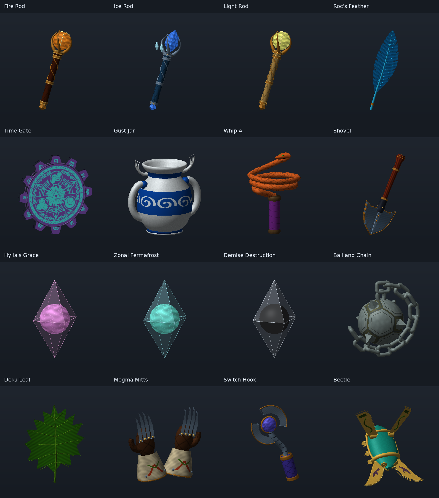

# NEI GI upgrade candidate

The final presentation candidate extends this original batch to **21 GI models**:
the lantern, Spinner, Cane of Somaria, Minish Cap and Roc's Cape are included.
Both native SoH and NEI feather callbacks use the approved feather. Current
scope, references and evidence are recorded in
[`../nei_final_preview/VERIFICATION.md`](../nei_final_preview/VERIFICATION.md).
The original batch history below remains the record of its earlier review.

This batch replaces the get-item presentation for 16 NEI items: Fire, Ice and Light Rods; Roc's Feather; Time Gate; Whip A; Shovel; Gust Jar; Hylia's Grace; Zonai Permafrost; Demise Destruction; Ball and Chain; Deku Leaf; Mogma Mitts; Switch Hook; and Beetle.

The same bindings cover pickups, randomized shops and shuffled freestanding items that call `GetItemEntry_Draw`. Actor and held-item resource paths are unchanged. Source resources are bundled under `soh/assets/custom/objects/nei_gi_redesign/`. An older build without these bindings cannot use the standalone archive.

The **NEI item effects** checkbox in NEI Custom Items defaults off. Enabling it adds bounded deterministic presentation effects: native-color rod/spell motes, green leaf flecks and neutral shimmer on the remaining supported custom items. It does not change item pools, save data or gameplay effects. Missing replacement passes preserve the original item draw.

Demise's core is black (`#000000`) with a pale neutral translucent shell. Time Gate and Gust Jar are upright; the shovel remains tilted. Whip A is a new reconstruction based on the user-supplied screenshot of skeijer's unreleased model, not his original mesh. The Time Gate reference image was supplied with the existing item assets.

The user approved the offline designs on September 27, 2026, after reviewing all 16 items and revised front/back comparisons. The final Beetle uses a mechanical teal/brass casing and crescent pincers. Roc's Feather retains the approved open tuft clefts with clearer barb detail. Ball and Chain uses forged iron plates, pointed spikes, and heavy individual links. The supplied Beetle and Twilight Princess Ball and Chain images are preserved as visual references.



These are renders of the exported model geometry, without game particle effects. The spell cores are the actual assets; the pale crystal edges are modeled strips, not preview wireframes. Runtime effects surround the models without replacing their surfaces.

## Reproduce and check

`CHECKPOINTS/` retains each exact GLB and its metadata/front/back views. `SOURCE/` contains the Python mesh authoring and software preview renderer (numpy and Pillow required); `REFERENCES/` contains the preserved inputs.

```sh
python3 tools/nei_gi/verify_assets.py
python3 scripts/diagnostics/run_nei_gi_tests.py
python3 tools/nei_gi/package_archive.py /tmp/NEI_GI_Upgrade_Approved_POC3.o2r
```

The renderer tests compile against the checkout's actual libultraship and SoH headers; a C++20 compiler and nlohmann-json headers are required. The archive contains only these GI-specific resources with identical base/Alt copies. It is one combined pack.

To regenerate authoring checkpoints, run `python3 tools/nei_gi/SOURCE/build_batch.py`; copy the resulting `tools/nei_gi/RESOURCES/objects/nei_gi_redesign/` into the corresponding custom-assets directory before validating and packaging. Regeneration does not silently replace shipped assets.

## Acceptance still required

Compiled tests and offline previews do not prove game appearance. Check one shop and shuffled freestanding pickup with effects off/on, inspect rod-tip placement, rotate the three transparent spells, and repeat with Alt Assets toggled. Check pickup scale, scene re-entry and pause/unpause. This remains a POC until those configurations are accepted.
